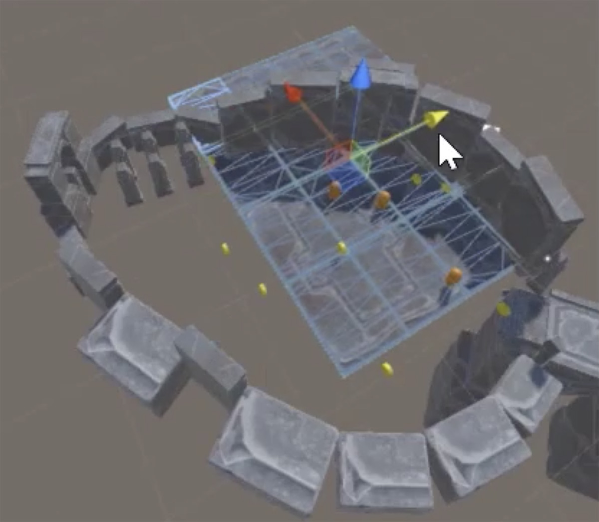
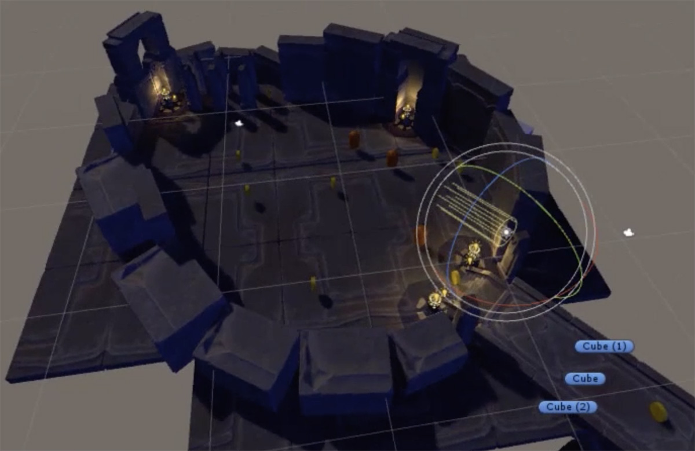

# Art and Sound Integration

## Importing Models and Textures

In this process we'll **import models and texture files**, **setup some materials**, and then **create prefabs**, for later replace all the primitives of the Whitebox that are representing static elements, such as building or trees.

We don't need a lot of prefabs, **we can reuse the same for all the elements of the same type**, and modify the rotation, the size and shape for give variety (E.g. we can use a single wall to represent all the buildings, a tile for all the floor, etc.)

**Add colliders** to the prefabs that we don't want them to let the player pass through.

Create a new Scene to don't dirty the previous one.

Create folders for Models, Materials and Texture in the root of the Assets folder.

Drag and drop the models to the Models folder. When a model is imported, a Material folder is created, we don't need it here, just delete it, the same with the Animation component. Also import the textures (usually the Norm, Diffuse and Specular) into the Textures folder.

Drag and drop the model you want to use from the Project tab to the Scene, and drag and drop the Diffuse texture into it, then a Material with the same name as the texture is created in the Materials folder.

Select the material and add the Normal map and the Metallic (Specular), and adjust the smoothness.

Create the prefab of the GameObject and store it in the Prefabs folder.

## Replacing the Whitebox with Art

Having the previous prefabs created, we can **replace the Whitebox with them**.

This process is called **World Building**.

At replacing the primitives with the prefabs, we need to worry about **preserve the conditions of the Whitebox**, such as if we didn't left space between two objects, place its prefabs together, or if we altered the height or width of specific primitives, preserve it.

**Feel free to move Whitebox elements**, such as collectibles or NPCs.

Make sure that all elements that should **touch the ground** are doing it properly.

Add walls or objects without Mesh Renderer to **don't let the player exit the layout zone**.

If we set objects without the Mesh Renderer, make sure to assign an icon to be able to locate it in the Scene (selecting it at the left of the name in the Inspector).

## Particle Effects and Lighting

In this process we are going to **set the lights**.

Set a Directional Light with a good angle to cast good shadows, and another one with opposite angle with low intensity, without shadows and blue color (it is used to maintain darkness and allow the user to see the environment).

We can also set some Point Lights, Area Light or Spotlights. Also import the Particle System package, that it has some lightning prefabs (like a flame), or building our own ones.

To create a simply flame, put together a Point Light and a Particle System.

Once created, you can create a prefab and set some instance along the level.

## Importing and Linking Audio

In this process we are going to **add audio to the level to bring it to life**.

We can add, for example, an ambient audio and some object sounds (like the sound of a river, a torch, etc.)

Create a Audio folder in the root of the Asset folder, and import the audio files into it.

To add a audio to an object, create an Audio Source component and select the audio file in the AudioClip, and set the **Spatial Blend to 1 to set it as a 3D audio**.

To set the ambient audio, we can add it to the player character, that way we can listen it no matter where we go, or we can attach it to an object of the Scene, so we can add variance as we walk through.

Make sure that you have **only one camera** in the Scene, because they pick audio, and the camera position determines space of audio, so we only can have one.