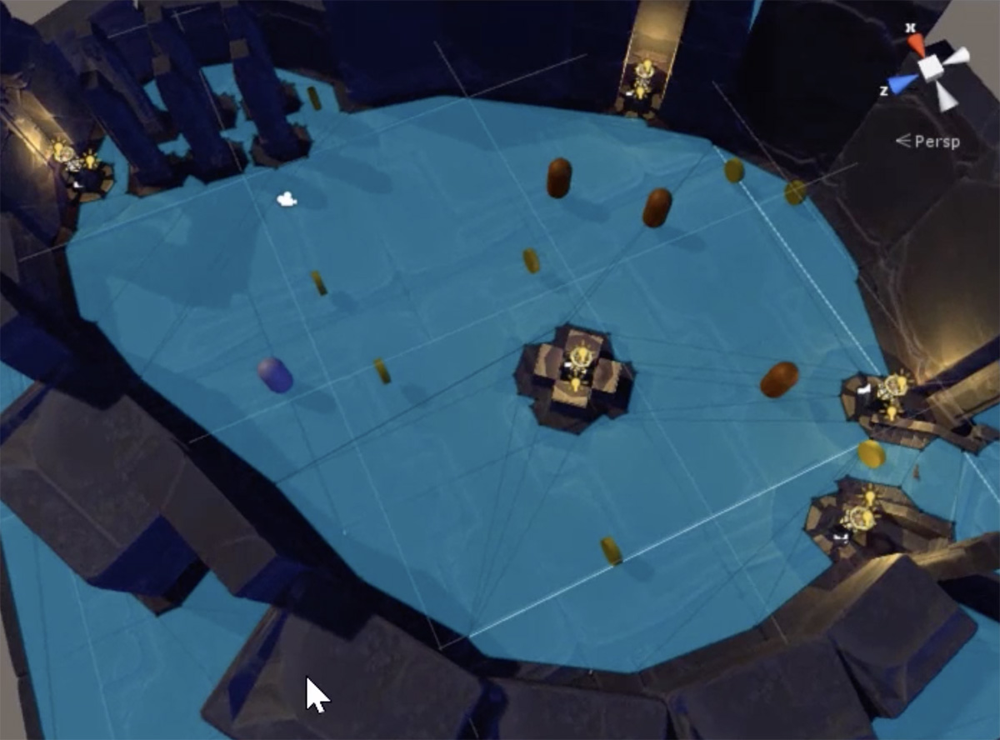
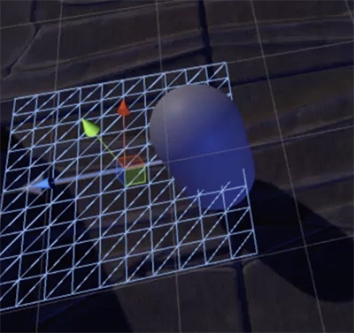
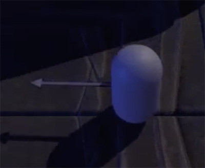

# Character Controller

## Design a Character Controller

To design a character controller we need to know what is the player perspective:

- **First-Person**: From the perspective of the character the player sees the world through their eyes.
- **Third-Person**: See the character in the world, the view can be top-down, ¾ angle or over-the-shoulder. This perspective allows us to watch the character animations

How the character will move:

- **WASD / Joystick**: Basic FPS movement
- **Automatic**: Character moves on its own based on story elements or world interactions
- **Click to Move**: Click a point on the ground or an interactive object to tell the character to move there

How is the camera controlled:

- **Mouse / Joystick**: Basic camera control
- **Automatic**: The camera moves based on the movement of the character

## Character Movement with Nav Mesh

NavMesh is Unity's **movement and pathfinder system**.

In this process we'll:

- **Set up the NavMesh**
- Create **walkable surfaces** and **non-walkable obstacles**
- **Add an Agent** (an object that move around using the NavMesh)
- **Bake the NavMesh**

First of all, we need to open the Navigation window, in Windows > Navigation.

To set walkable surfaces, select all walkable GameObjects and set them as **Static in the Inspector**. Then, in the Navigation window, set the option **Navigation Area** to Walkable.

To set obstacles, select all obstacles / walls, set them as Static, and in the Navigation Area select Non Walkable.

Create a Capsule that will be the player's character, and add it the **component Nav Mesh Agent**.

Go to the Bake tab of the Navigation window, and push the **Bake button**. When finish, the NavMesh will be saved as an asset, and it will appear in the Scene as a blue cap above the walkable area.



If there are spaces not cover by the NavMesh, can be because they are not touching, or there is a slope or step too high. To fix it, you can adjust the Bake settings or the affected GameObjects, and them re-bake.

## User Input

It's the time to add functionality to the character controller for user input. We'll:

- **Set the target destination** with WASD
- **Add mouse-look**, to control the camera with the mouse
- **Add controller input**, so the player can use a gamepad

In order to make the character to move, we need to add to the previous Capsule (the one that we created with a Nav Mesh Agent) a Rigidbody and a Script.

This is an example Script, where at start the goal is set to the current position of the GameObject, to not allow it to move at the start, and in each update, the goal is updated with the input that the player will be using.

`Input.GetAxis("Horizontal")`

- Get positive values moving to the right, and negative to the left
- Catch the A, S, left arrow and right arrow keys, and left and right movement of the gamepad

`Input.GetAxis("Vertical")`

- Get positive values moving to the top, and negative to the bottom
- Catch the S, W, top arrow and bottom arrow keys, and top and bottom movement of the gamepad

```C#
private Vector3 goal;
private NavMeshAgent agent;
//public GameObject cameraParent;

void Start() {
    Cursor.visible = false;

    goal = transform.position;
    agent = GetComponent<NavMeshAgent>();
}

void Update() {
    goal = transform.position
        + Vector3.right * Input.GetAxis("Horizontal")
        + Vector3.forward * Input.GetAxis("Vertical");
//        + cameraParent.transform.right * Input.GetAxis("Horizontal")
//        + cameraParent.transform.forward * Input.GetAxis("Vertical");

    Agent.destination = goal;
}
```

With this, we can move the character, but we don't know where is it aiming to. To achieve it, we can add a GameObject to its front, such as a plane, and add it a material made with an image of an arrow with a transparent background, and setting the Rendering Mode to Cutout.





To make the Camera follows the character position, we need to add a Script to the Camera. In the **Unity Standard Asset** there's a Script called **SmoothFollow** that allows us to do this. Just add it to the camera and select the character GameObject.

To add mouse-look to the camera, we need another Script, that also comes with the Unity Standard Assets. We need to create a empty GameObject and make it the parent of the Camera, and add it the Script Simple Mouse Rotator, and adjust the Rotation Range values. Also set the rotation of the parent to 0.

To add the gamepad look, we need to add an Project Input Property and edit the Script. Go to Edit > Project Settings > Input, search the Horizontal and Vertical Properties with the Type "Joystick Axis", duplicate them, give them a new name and change the Type to "4th axis (Joysticks)" for Horizontal, and "5th axis (Joysticks)" for Vertical.

Then open the Script and edit the following lines:

```C#
inputH = CrossPlatformInputManager.getAxis("Mouse X") + Input.getAxis("HorizontalRight") * 0.5f;
inputV = CrossPlatformInputManager.getAxis("Mouse Y") + Input.getAxis("VerticalRight") * 0.5f;
```

At this point, if we move the camera and the player, but the movement of the player is not natural, because their right and forward directions are following the World's right and forward directions. To fix this, the character has to follow the camera direction (using the commented lines of the script and attaching the parent of the Camera to it).

## Ranged Attack

The final step in the character controller is set up a ranged attack. We'll:

- **Set up a projectile prefab**, which can be a bullet or a spell
- **Take the User Input** to fire the projectile
- **Handle the impact and damage**

We need to create the **Resources folder**, from it Unity will be able to load things into a Scene.

Create a projectile and drag and drop it into the Resources folder. It can be as simply as a Particle System simulating a spell.

The next thing to do is create a Script and attach it to the character.

```C#
void Update() {
    If (Input.GetButtonDown ("Fire1")) {
        Instantiate (Resources.load (Resources.load ("Projectile"), transform.position, transform.rotation);
    }
}
```

Fire1 is the default Input Property of Unity for the left button of the mouse, and the primary button of the gamepad.

When one of these buttons are pushed, the prefab Projectile is instantiate in the Scene with the position and rotation of the player.

For make the projectiles move, we need to attach them a new Script

```C#
void Update() {
    transform.Translate (Vector3.forward * Time.deltaTime * 10);
}
```

The final thing we need to add is damaging the enemies when they are hitted with a projectile.

To do so, we need to set the Tag "Enemy" to the enemy prefab, and add it a RigidBody component.

We also need to add a RigidBody component, with the Is Trigger option, to the projectile prefab, and update its Script with the following:

```C#
void OnTriggerEnter(Collider other) { 
    If (other.tag == "Enemy") {
        Destroy (other.gameObject);
        Destroy (gameObject);
    }
}
```

When the projectile collide with a GameObject with the Tag "Enemy", both GameObjects will be destroyed.

We can also add a Audio Source to the projectile to be played at instantiate it.