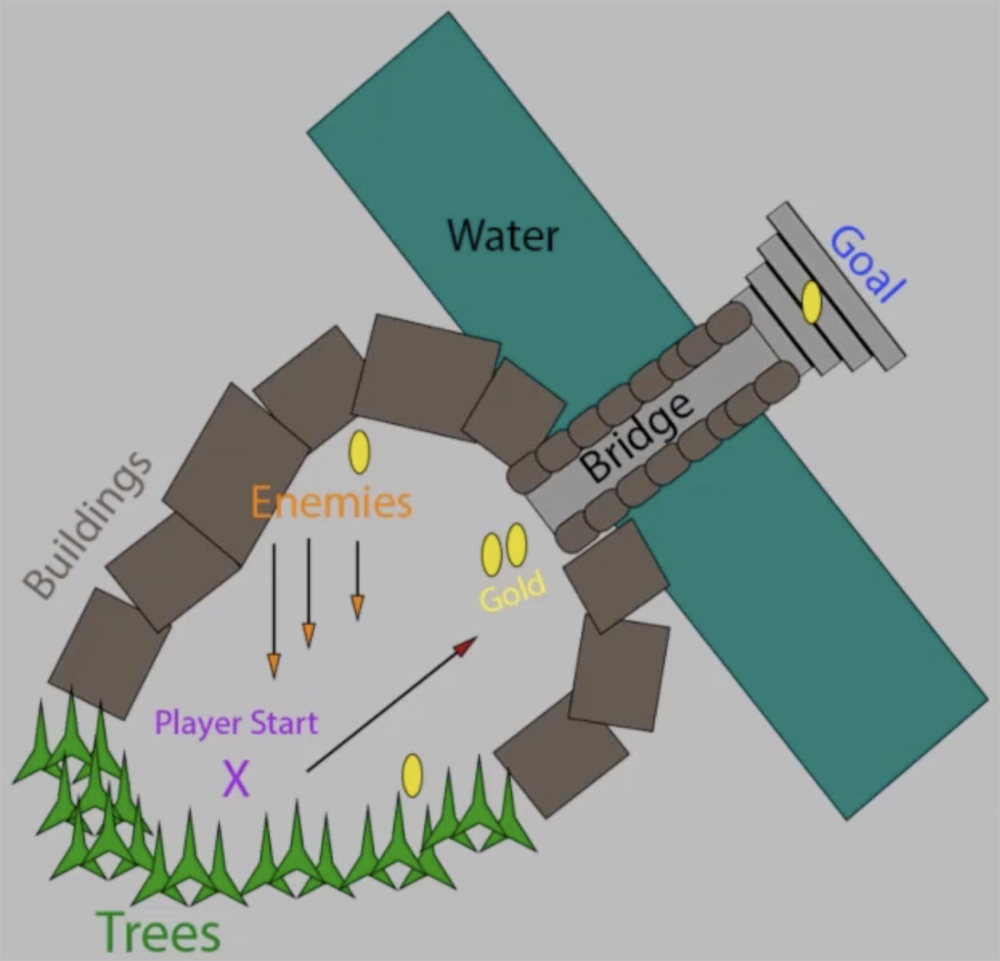
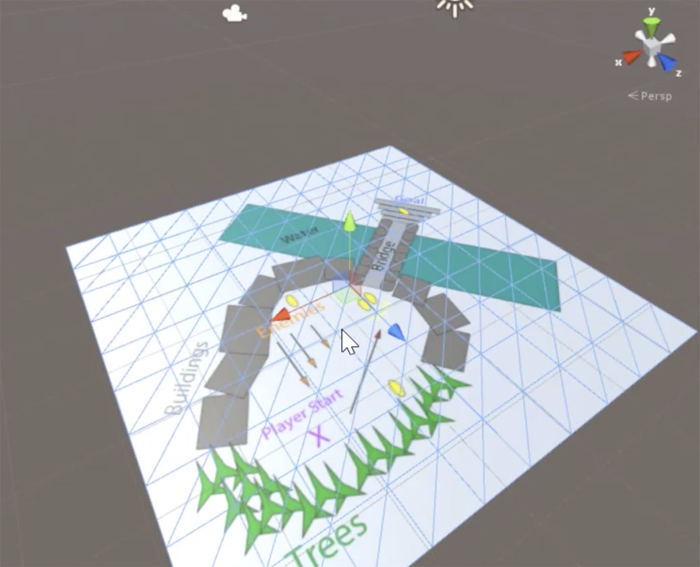
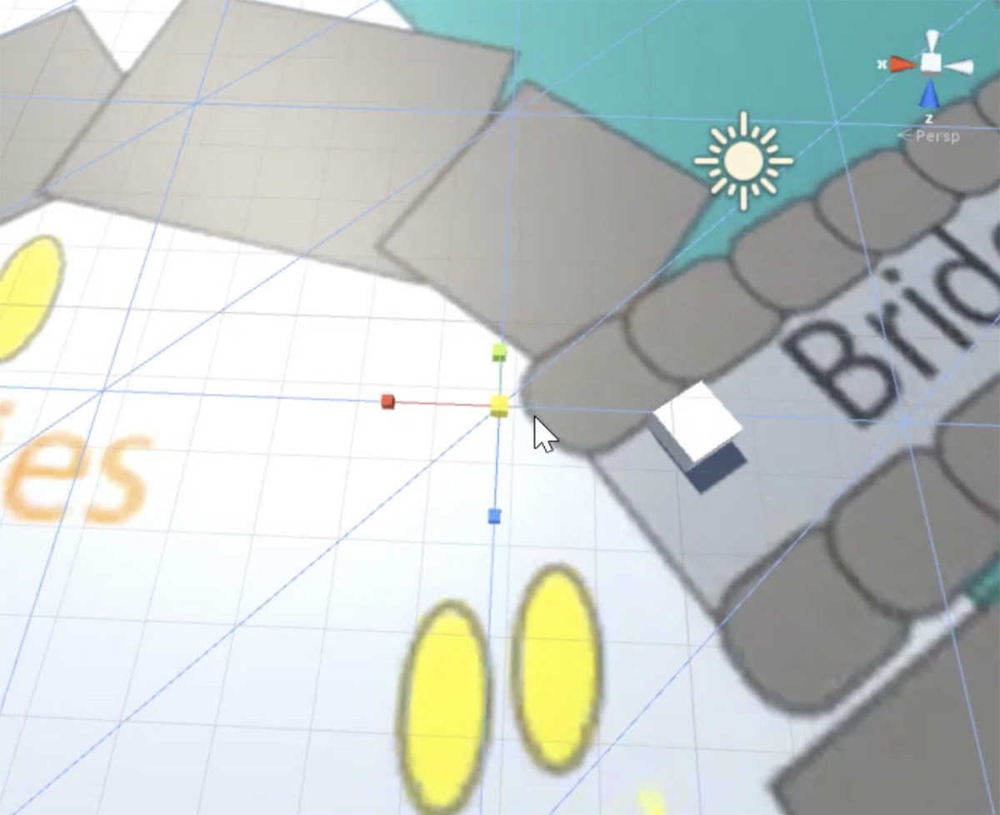
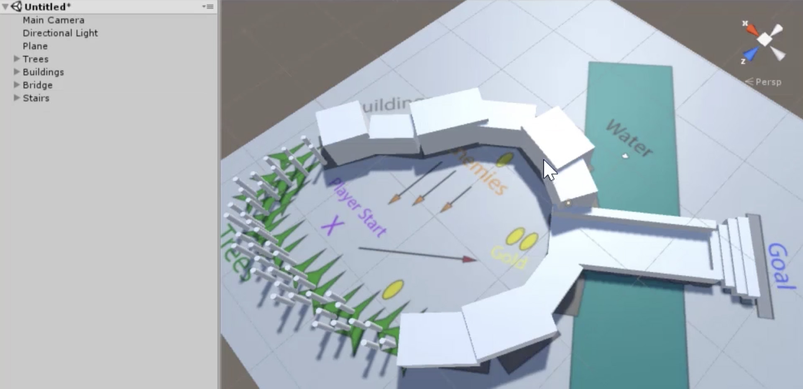
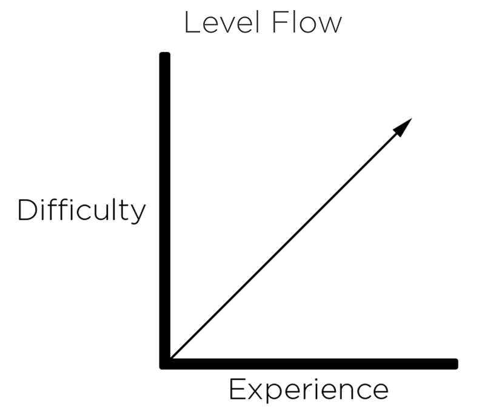
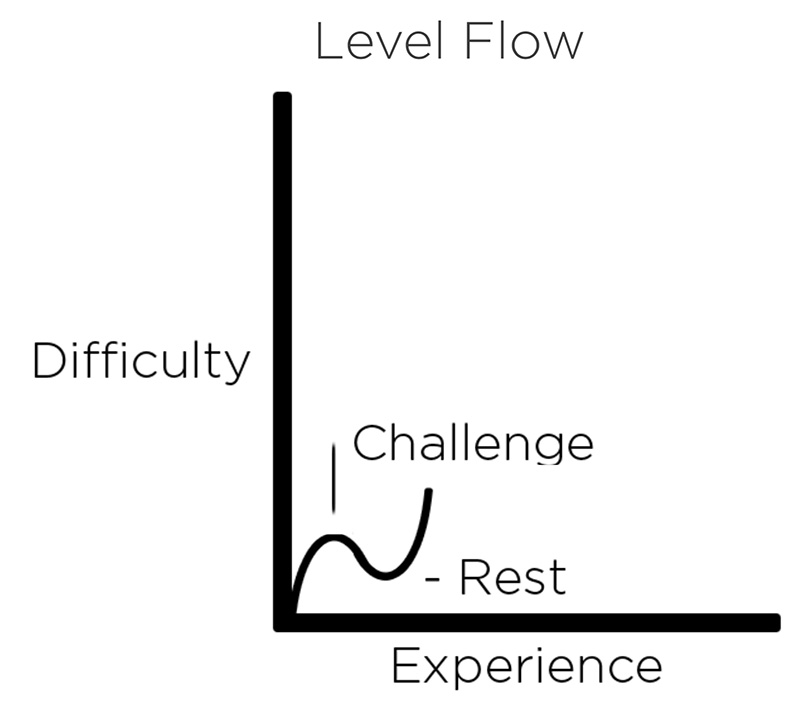
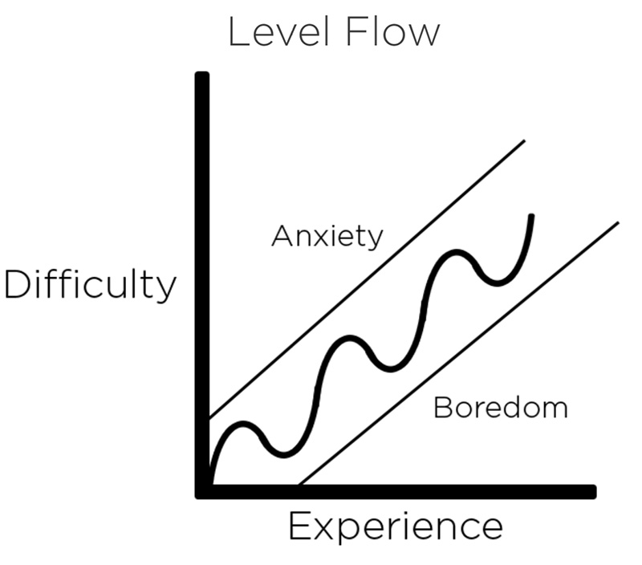

# Create an Environment

## Create a Layout

The first thing that we do at create a new level is create a layout.

The layout is created in **2D** to **play with ideas** before getting into the engine, it also allows us to **make multiple attempts** (so it makes easy to start over at making a mistake).

We can show a 2D layout to someone to **get feedback early** on, that makes easy to **revise quickly** (it is easy to make changes to a 2D layout that a 3D layout).

The layout can be done by **drawing software** or with paper and pen.

As a prototype, **don't make things that looks good**, just try to make something to convey information.

The layout starts with the **player start location**, and begging filling the environment from there.

Each time we add a new element, **label** it to know what that item represents.

Use **distinct shapes and colours** for each element.

**Draw the direction** of moving elements (such as NPCs) as arrows, to know how they make into the scene.

Also draw the **player movement** with an arrow to show which way the player is moving through the scene.

## Blocking it Out

This process is called **Whiteboxing**.

Creating a **first-pass of a level**, primarily **using white cubes** and other 'primitives'. It is also called Greyboxing, creating a Whitebox with grey primitives.

**Primitives are basic building blocks** for 3D world-building (such as Cubes, Spheres, Cylinders, Capsules and Planes).

In this process we **import the level layout** and **scale to appropriate size**, **place primitives** in the layout and **adjust the height and width** of them.

At import the layout, **create a Plane and drag the layout into it** (it's important that it has 1:1 size ratio, otherwise it has to be adjusted).

To scale the layout, **create a Cube to use it as reference** (its initial size is 1x1 world unit), move it to a key emplacement of the layout which size is easy to compare (E.g. a bridge or a statue), and scale the layout.

**Start building the level using primitives**. You can use any primitives that feel good with the element that you are creating (E.g. for trees use Cylinders, for buildings use Cubes, etc.).

You don't need to place the primitives perfectly, just **use the layout as a reference** to place them.

In this process it's important to **get the sense of the space** (E.g. to recreate a forest, create a skinny and tall Cylinder, duplicate it several times leaving enough space between them, doing to feel it like a cluster of trees).

You **can choose if the player can pass between the objects**, in order to left enough space, create a Cube to use it as a reference. If you don't want that he player pass between them, just place them together without leaving any space.

It's also important to **keep the Hierarchy organized**, naming the elements and grouping them.

## Creating Prefabs

**Identify key reusable** items that work well as prefabs.

**Assign colors for each type of element** to help to maintain an organization.

Prefabs allow make easy changes.

Create a folder in the root of the Asset folder to store the prefabs, and another for the materials, which will have the colours for the prefabs.

Generally you want to make prefabs for **anything that should look and behave the same everywhere its use** (E.g. collectible items such as gold coins).

To make a prefab, just drag the object from the Hierarchy to the Project. The prefab objects in the Hierarchy has a blue color to differentiate them.

If you have several instances of a prefab in the Hierarchy and makes changes in one of them, you can apply those changes to all of them.

## Placing Prefabs

Having created the prefabs of the interactive part of the level, it's time to think how we are going to place them through the scene.

When doing this, we are going to think about the **Level Flow**, which is **how we are going to increase the difficulty while the player gets experience**.

It is tempting to have a linear increase, **as the player gets experience, the game becomes more difficult**.

A better approach is to add a new **challenge, followed by a moment of rest** where the player can practice the learned.

Then continue adding new challenges, followed by moments of rest, as we **increased the difficulty over all**.

We want to avoid to add more difficulty too quickly or several challenges at once, because that **cause anxiety**.

We also want to avoid adding too few challenges or having the difficulty increase too slowly, because that **cause boredom**.

The area of the middle is what we call flow, and is what we want to achieve.

Placing the prefabs it's important to remember that we **don't need to match the layout perfectly**, because this is the phase were we experiment with different options of how we want the level to be played.

## Testing and Iterating

In this final phase we are going to **import character controllers** and **test the layout** with a first-person controller. Then we'll **adjust the layout** through the playthrough.

The purpose of use a first person controller in the whitebox is just to **get a sense of what the space feels like**.

To import the character controllers, go to Assets → Import Package, then select the Character package. Inside the Characters folder we can found the controllers.

Open the First Person folder, then Prefabs folder, and drag and drop the Rigidbody prefab into the Scene at the player start location.

Then if we push the Play button, we can test the layout. We can check:

- if the scale of the layout is correct
- if is clear the path that the player has to follow
- if the distance between the challenges is good enough to leave a rest
- if the difference of the quantity of prefabs of one challenge to the next makes a good difficulty without cause anxiety and boredom
- etc.

It's a good idea to **make changes while testing** to try to get the best feeling.