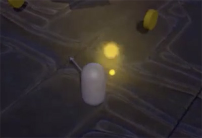

# Scripted Interactions

## Meaningful Interactions

We should ask ourselves what are the **Core Mechanics of the game**.

The Mechanics are **rules of the game that structure the gameplay** and form together to create varying dynamics such as resource management.

Some examples are:

- Collect gold
- Defeat enemies
- Explore
- Reach the goal

Having those mechanics, we can break them down into solid objectives for the player:

- Walk over gold to collect it
- Destroy enemies to get gold
    - Enemies drop gold when killed
- Find hidden key to unlock chest
    - At open a chest the player earn gold
- Reach the end of the level
- Running into an enemy kills the player

## Collectible Objects

In this process we'll set up a mechanic that allows the player gather collectible items when he walks into them.

For do it we need to:

- Tag the coin prefab as "Coin"
- Add a RigidBody to both the coin prefab and the player character
- Mark the Is Trigger option on the coin prefab
- Add a new Script to the player character

```C#
private int gold;

void OnTriggerEnter(Collider other) {
    if (other.tag == "Coin") {
        Gold++;
        Destroy (other.gameObject);
    }
}
```

To make it more realistic we can create a prefab with an Audio Source Component and a Particle System to show it when the player get a collectible.



## Enemies Drop Loot

We want our enemies to drop gold when they die, so we need to have the collectible prefab in the Resources folder, to be able to instantiate it from a Script. We also will set an special effect when the enemy dies.

We need to add the add the following lines to the projectile Script, because it's the one that destroy the enemies.

```C#
Instantiate(Resources.Load("Collectable"), other.transform.position, Quaternion.Euler(90, 0, 0));
Instantiate(Resources.Load("PickupEffect"), other.transform.position, Quaternion.Euler(90, 0, 0));
```

With Quaternion.Euler we can rotate the instantiated in the X, Y and Z plane, to make it appear straight.

## Key and Lock

Creating unlockable places or objects (such as a treasure room or a chest) **makes the more explorable player investigate** for the level **looking the key**.

An unlockable object can be as simply as two cubes simulating a chest, the parent with a Rigidbody, a Collider with the Is Trigger option enabled, and tagged as "Chest".

And the key a cylinder and a cube, the parent with a Rigidbody, a Collider with the Is Trigger option, and tagged as "Key".

We need to edit the character collective Script adding conditions for the key and the chest:

```C#
using UnityEngine;
using System.Collections;

public class Collection : MonoBehaviour {

    private int gold;
    private hasKey;

    void OnTriggerEnter(Collider other) {
        if (other.tag == "Coin") {
            Gold++;
            Instantiate(Resources.Load("PickupEffect"), other.transform.position, other.transform.rotation);
            Destroy (other.gameObject);
        }
        If (other.tag == "Key") {
            hasKey = true;
            Instantiate(Resources.Load("PickupEffect"), other.transform.position, other.transform.rotation);
            Destroy (other.gameObject);
        }
        If (other.tag == "Chest") {
            Gold += 10;
            Instantiate(Resources.Load("PickupEffect"), other.transform.position, other.transform.rotation);
            Destroy (other.gameObject);
            hasKey = false;
        }
    }
}
```

## Reach the End of the Level

The final element is **handle the ending of the game**. We'll a **lose condition**, when our character collide con a Enemy, and a **win condition**, when the character reaches the end of the level.

We need to create a GameObject at the end of the level with a Collider with the Is Trigger option enabled and tagged as "Goal".

We need to add a new Script to the character

```C#
using UnityEngine;
using System.Collections;
using UnityEngine.SceneManagement;

public class Popup : MonoBehaviour {

    void OnTriggerEnter(Collider other) {
        If (other.tag == "Enemy") {
            SceneManager.LoadScene (0);
        }
        If (other.tag == "Goal") {
            SceneManager.LoadScene (0);
        }
    }
}
```

SceneManager.LoadScene allows us to load the specified Scene by its index. To load a Scene it has to be added to the Building Settings.