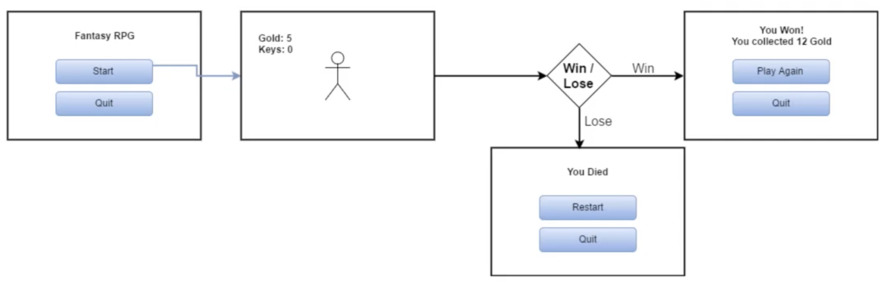
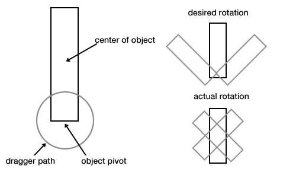
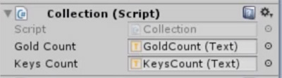
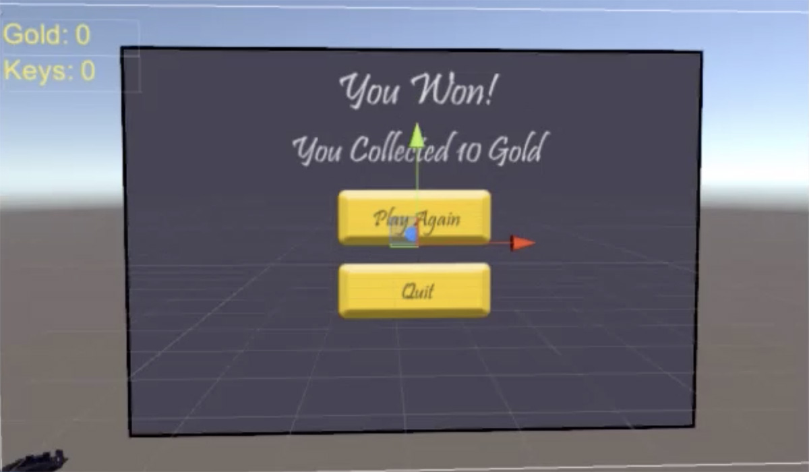
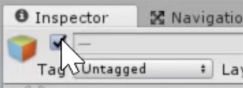

# User Interface

## Designing the UI

We need to ask ourselves what does the player need to know, and this will tell us the UI Elements that we need to implement.

A very basic example:

- Buttons to start and quit
- Display collectible collected
- Tell the player if he won or lost
    - Buttons to restart or quit

It's also very helpful know how does the user move between screens. For it, we need to draw a flow diagram.



## Start Screen

The first thing to do is create a new Scene, then select the Camera GameObject in the Hierarchy, and in the Inspector, change the Clear Flags property to Solid Color, and select a Background color.

The next is create a Canvas, go to Component > UI > Canvas.

The Canvas is the way that Unity handle all UI elements. Its size is set by the "Aspect Ratio" property on the Game window.

Change the UI Scale Mode of the Canvas Scaler component to "Scale with Screen Size", to allows the Canvas to adapt to any screen size. Also it's a good idea set the "Reference Resolution".

To add text to the Canvas, go to GameObject > UI > Text. You'll need to adapt it to the screen by scaling the font size and the GameObject width and height.

The Canvas can adjust the position of the UI elements when the screen size changes, by using the anchor and pivot points of each UI element.

The anchor points allow us to keep the UI element to a relative distance from where they are set.


The pivot point is the axis of the object to make rotations



Having this in mind, create two buttons, one to load a Scene and other to exit the game.

Create an empty GameObject with a Script component with the following lines:

```C#
using UnityEngine.SceneManagement;

public void LaunchGame() {
    SceneManager.LoadScene(1);
}

public void QuitGame() {
    Application.Quit();
}
```

Then set that GameObject to the OnClick function of each button, selecting the appropriate function.

With the first button, we'll load the second Scene selected in the Build Settings, and with the second button, we can leave the game.

## Heads Up Display

We are going to create a heds up display to show to the player the current ammount of gold and keys. To do it, we need to:

1. Create a Canvas and set the `UI Scale Mode` to `Scale With Screen Size`, am adequate resolution (i.e. 1920x1080). and the `Match` to 0.5.
2. Add a Text, to display the gold counter, set the text, adjust the size and set the pivot and the position at the top left corner
3. Duplicate the previous Text, to use it for the key count.

Then we need to edit the character collective Script to edit the texts of the two Text objects when a gold of key is collected.

```C#
using UnityEngine;
using System.Collections;
using UnityEngine.UI;

public class Collection : MonoBehaviour {

    public int gold;
    private hasKey;

    public Text goldCount;
    public Text keysCount;

    void OnTriggerEnter(Collider other) {
        if (other.tag == "Coin") {
            Gold++;
            goldCount.text = "Gold: " + gold;
            Instantiate(Resources.Load("PickupEffect"), other.transform.position, other.transform.rotation);
            Destroy (other.gameObject);
        }
        If (other.tag == "Key") {
            hasKey = true;
            keysCount.text = "Keys: 1";
            Instantiate(Resources.Load("PickupEffect"), other.transform.position, other.transform.rotation);
            Destroy (other.gameObject);
        }
        If (other.tag == "Chest") {
            Gold += 10;
            goldCount.text = "Gold: " + gold;
            keysCount.text = "Keys: 0";
            Instantiate(Resources.Load("PickupEffect"), other.transform.position, other.transform.rotation);
            Destroy (other.gameObject);
            hasKey = false;
        }
    }
}
```

Then attacht the two Texts to the script variables, selecting the Character object in the Hierarchy, and draw and drop the Texts to the variables in the Inspector.



## Win and Lose Screens

The final step is to add a pop-up making the player know if he won or loss.

We start with the win screen.

Add a panel to the previous Canvas and adjust its size to only cover a part of the screen. Set a background color or image and add a Outline, to differenciate it from the environment.

Add two Texts, one indicating that the player wins, and another for display the ammount of gold collected.

And two Buttons, one for restart the game and another for quit.



At finish the win screen, duplicate it to make the lose screen, editing the Texts and the Buttons.

Then select the two panels in the Hierarchy, and disable them by clicking the checkbox of the Inspector.



We need to edit the script that handles the end of the game:

```C#
using UnityEngine;
using System.Collections;
using UnityEngine.SceneManagement;
using UnityEngine.UI;

public class Popup : MonoBehaviour {

    public GameObject LosePopup;
    public GameObject WinPopup;
    public Text FinalGold;
    
    void OnTriggerEnter(Collider other) {
        If (other.tag == "Enemy") {
            LosePopup.setActive(true);
            // Freeze the game to disable movement
            Cursor.visible = true;
            Time.timeScale = 0;
        }
        If (other.tag == "Goal") {
            WinPopup.setActive(true);
            FinalGold.text = "You collected " +
                GetComponent<Collection>().gold +
                " gold!";
            // Freeze the game to disable movement
            Cursor.visible = true;
            Time.timeScale = 0;
        }
    }
}
```

After editing the script, we need to attacht the Panels and the gold Text to the script

And set the `LaunchGame()` and `QuitGame()` scripts to the buttons.